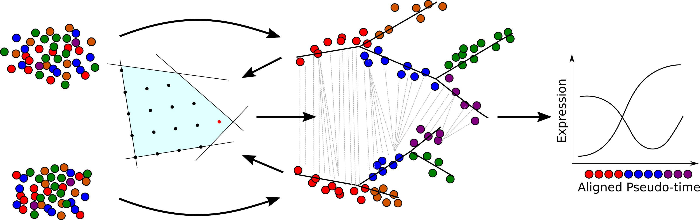

# Trajan #

### Alignment of complex trajectories from single-cell RNAseq experiments. ###



## Installing Trajan ##

All dependencies are bundled with Trajan. In particular, Trajan implements its own non-linear solver and does 
not rely on any external (I)LP solver. To ```convert``` different input formats accepted by Trajan you need 
to install the Boost graph library. To build Trajan, simply run

```
make
```

## Running Trajan ##

### To begin ###

First you will need to obtain a pair of trajectories (trees) using any with any of the available trajectory-building techniques (Saelens et al. 2018), over 50 trajectory inference methods have been developed since 2014. Trajan does not make any assumptions on the type of methods used to build your trajectory, one should take of converting the output in into a suitable input format for Trajan. In our examplary workflow we will describe how to transform the output obtained from Monocle (Trapnell, C. et al. 2014) into a suitable input for Trajan.

In general one should provide for each tree, the following files:
1. __Edge Set__: ```t.tree```
2. __Map__: ```t.map```

additionally a Distance Matrix between all pairs of nodes with an extra row and column correponds to penalty assignment:
  - __Distance Matrix__: ```distance_matrix.csv```

A typical input Folder should look like this: 
  - t1.tree
  - t1.map
  - t2.tree
  - t2.map
  - distance_matrix.csv  

An example of inputs is provided in the directory ```/example```. 

### Usage ###

Once compiled. Trajan can be run easily with the following command:

```
trajan <tree_1> <map_1> <tree_1> <map_1> <distance_matrix> <align> <constraints> <weightfunc> <k> <vareps> <coneps> <solver>
```

For our typical input:

```
trajan t1.tree t1.map t2.tree t2.map distance_matrix.csv output_solution.csv 2 e 0 0 0.0001 2 
```
### Arguments ###
Hali implements various strategies to find an (or near) optimal solution. Its non-linear solver is based on an 
augmented Lagrangian approach. Hali can provide an optimal fractional solution or an optimal integral solution
obtained through branch-and-cut (BnC). It can also find a (suboptimal) integral solution based on a greedy 
strategy or enforce integrality by non-linear constraints. 

`<solver>`
  : 0=greedy  
  1=fractional  
  2=fixed parameter tractable (FPT) algorithm (__default__) <br>
  3=covering-packing  
  4=greedy branch and bound  
  5=non-linear integral  
  6=warm-start integral from fractional <br>
  7=BnC with breadth-first-search strategy <br>
  8=BnC with depth-first-search stategy <br>
  9=BnC with hybrid scheme (combine 7 & 8)

Options 3,4 and 6 combine different solver strategies that require problem specific tuning. 

#### Input/Output formats

Input: 

`<tree>`
  : input tree file in the following format:        
  [child node] [parent node] default [newline] ...

`<map_1>`
  : a map from row index in the distance matrix (start from 0) to nodes in t1:        
  [row index] [node] [newline] ...
  
 `<map_2>`
  : a map from column index in the distance matrix (start from 0) to nodes in t2:        
  [column index] [node] [newline] ...

Output:

`<align>`
  : output the final alignment in file in the following format:
  [node in first graph] [node in second graph] [fractional solution] [newline] ...

#### Model adjustment


   
`<constraints>`
  : 0=unconstrained matching   
  1=forbid crossing edges  
  2=forbid crossing and semi-independent edges (__default__)

`<weightfunc>`
  : e=edit distance  

#### Miscellaneous   
   
   
`<vareps>`
  : edge weight threshold (all edges with weight below vareps will be ignored) - default 0

`<coneps>`
  : tolerance - default 1e-6

## Example Workflow using Monocle generated Trajectories ## 
This section provides an example where the complex trajectories are inferred from HSMM and Fib-MyoD scRNA-seq datasets. The binary (C++) trajan software only takes the input described as above. To handle different inputs (from Monocle 2 and other trajectory-building tools) and to visualize the trees and the alignment, we provide R scripts with examples (```examples.R```) in the directory ```/Rscripts```. Various input types are handled in a following single Trajan R object: 
```
Trajan (t1, t1_root = NULL, t2, t2_root = NULL, t1_data = NULL, t2_data = NULL, distance_matrix = NULL, penalty = "avg", method = "euclidean")
```
  - The inputs ```t1, t2, t1_data, t2_data, distance_matrix``` must be of a data.frame.
  - The input trees ```t1, t2``` can be either: <br>
    + 2D data.frame: each row corresponds to an arc (child, parent), or <br>
    + 2D data.frame of undirected edges ((child, parent) or (parent, child)) and roots: ```t1_root (string), t2_root (string)```.<br>
  - A ```dissimilarity/distance matrix``` where (i,j)-entry corresponds to the distance between i<sup>th</sup> node of ```t1``` and j<sup>th</sup> node of ```t2```, row names and column names must be matched with ```t1``` nodes and ```t2``` nodes, respectively. A Trajan object is initialized as follows: <br>
    ```trajan <- Trajan(t1 = t1, t2 = t2, distance_matrix = distance_matrix)``` for rooted tree input, or <br>
    ```trajan <- Trajan(t1 = t1, t1_root = t1_root, t2 = t2, t2_root = t2_root, distance_matrix = distance_matrix)``` for undirected tree with root provided. 
  - In case the distance matrix is not given (=NULL), it can be computed from expression matrix for the (interpolated) cells used to define the trees ```t1``` and ```t2```, stored in ```t1_data``` and ```t2_data``` in which each column corresponds to expression values of a cell.  The user can specify the [distance metrics](https://www.rdocumentation.org/packages/amap/versions/0.8-16/topics/Dist) to be used: “euclidean”, “pearson”, “spearman”, etc, controlled by parameter ```method``` :<br>
    ``` trajan <- Trajan(t1 = t1, t1_data = t1_data, t2 = t2, t2_data = t2_data, method = “euclidean”)``` for the rooted trees input with Euclidean metric, <br>
    ```trajan <- Trajan(t1 = t1, t1_root = t1_root, t1_data = t1_data, t2 = t2, t2_root = t2_root, t2_data = t2_data, method = “pearson”)``` for the undirected version with Pearson metric. 
  
  - Trajan optimization model requires penalty for each node, that it, the cost of leaving a node unmatched from the alignment. This can be computed by independent schemes (```penalty = “avg” or penalty = “max”```) or the dependent scheme based on solution of dynamic time warping (dtw).   However, the user can use any self-defined penalty, stored in the last row and last column of the distance matrix (with keyword ```penalty```).
   
#### Export the inputs for binary (C++) Trajan:
   ```export(trajan, t1_treefileName, t1_mapfileName, t2_treefileName, t2_mapfileName, distance_matrixfileName)```
Arguments  ```t1_treefileName, t1_mapfileName, t2_treefileName, t2_mapfileName, distance_matrixfileName``` are optional. In this case, the export files will have default names: ```t1.tree, t1.map, t2.tree, t2.map, distance_matrix.csv```. 

Finally, simply run the binary trajan with the following command line:

```trajan t1.tree t1.map t2.tree t2.map distance_matrix.csv output_solution.csv 2 e 0 0 0.0001 2```

The optimal solution (alignment between ```t1``` and ```t2```) will be stored in file ```optimal_solution.csv```.  

#### Visualization of the rooted trees and alignment: 
```plot_first_tree(trajan)``` <br>
```plot_second_tree(trajan)``` <br>
```plot_solution(trajan, optimal_path = optimal_solution)```, where optimal_solution (```data.frame```) stores the optimal alignment between two trees.

<!---
Differentiation vs Reprogramming (Cacchiarelli, D. & Trapnell, C. et al. 2018)
-->

## References

<div id="refs" class="references">


<div id="ref-trapnell:2014">
  
The dynamics and regulators of cell fate decisions are revealed by pseudotemporal ordering of single cells
Cole Trapnell  et al. Nature Biotechnology volume 32, pages 381–386 (2014)
<https://doi.org/10.1038/nbt.2859>

</div>


<div id="ref-trapnell:2018">

Aligning Single-Cell Developmental and Reprogramming Trajectories Identifies Molecular Determinants of Myogenic Reprogramming Outcome.
Cacchiarelli, D. & Trapnell, C. et al. Cell Syst. 7(3), 258-268 (2018).
<https://doi.org/10.1016/j.cels.2018.07.006>.

</div>

<div id="ref-alpert:2018">

Alignment of single-cell trajectories to compare cellular expression dynamics
Ayelet Alpert, Lindsay S Moore, Tania Dubovik & Shai S Shen-Orr.
Nature Methods volume 15, pages 267–270 (2018)
<https://doi.org/10.1038/nmeth.4628>.

</div>

<div id="ref-Saelens:2018">

A comparison of single-cell trajectory inference methods: towards more accurate and robust tools
Wouter Saelens, Robrecht Cannoodt, Helena Todorov, Yvan Saeys.
bioRxiv (2018)
<https://doi.org/10.1101/276907>.

</div>

